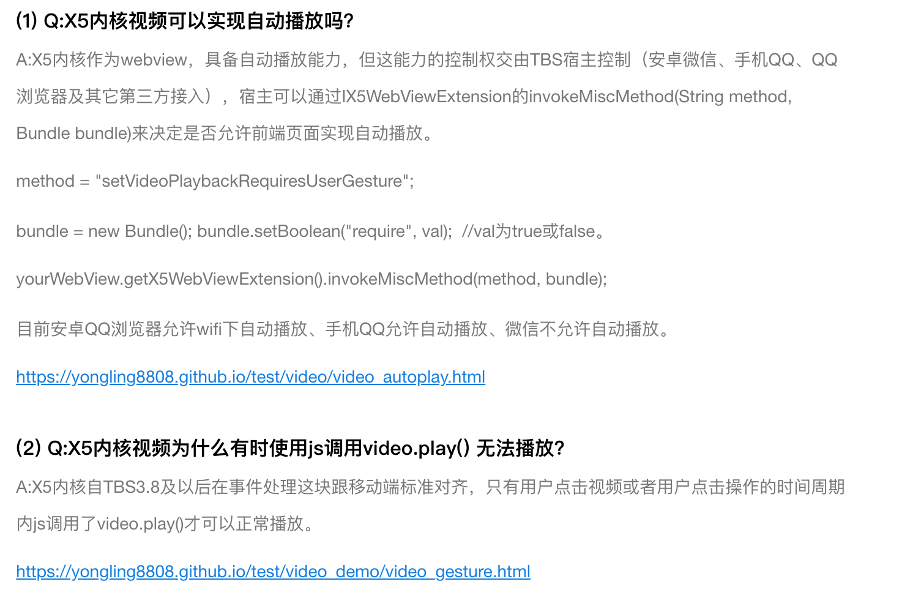

# 腾讯x5浏览器内核

## video

目前安卓QQ浏览器允许wifi下自动播放、手机QQ允许自动播放、微信不允许自动播放。

### 解决

```jsx
// iOS
document.addEventListener("WeixinJSBridgeReady", function () { 
    document.getElementById('audio').play(); 
  document.getElementById('video').play(); 
}, false);
// Andriod
document.addEventListener("click", function () { 
    document.getElementById('audio').play(); 
  document.getElementById('video').play(); 
}, false);
```



[https://x5.tencent.com/tbs/guide.html](https://x5.tencent.com/tbs/guide.html)

